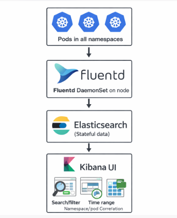
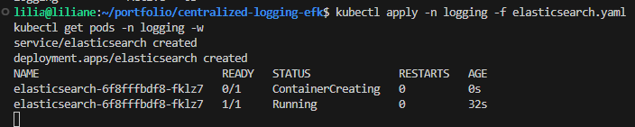
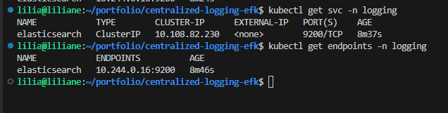
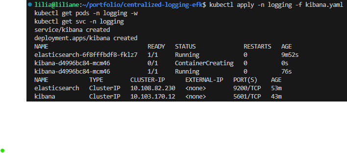
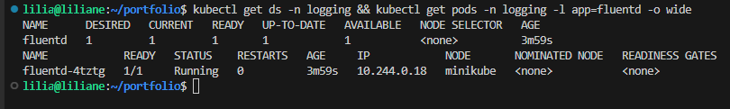
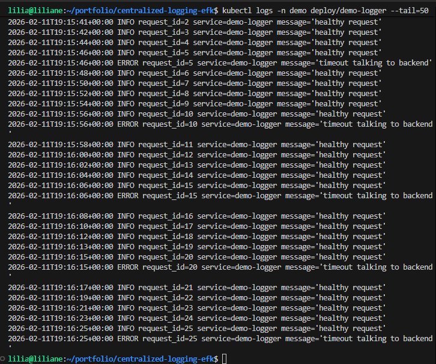
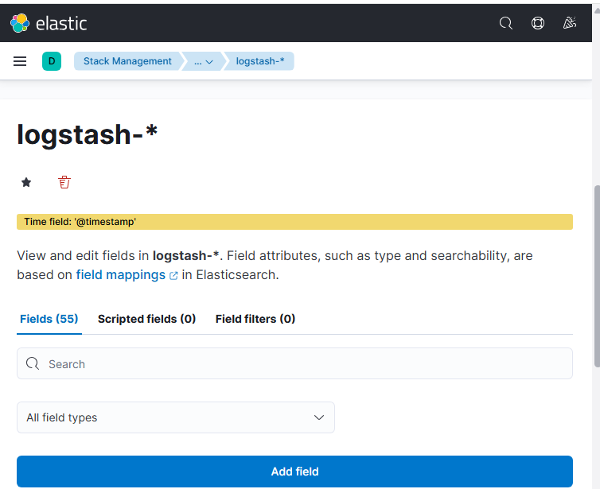
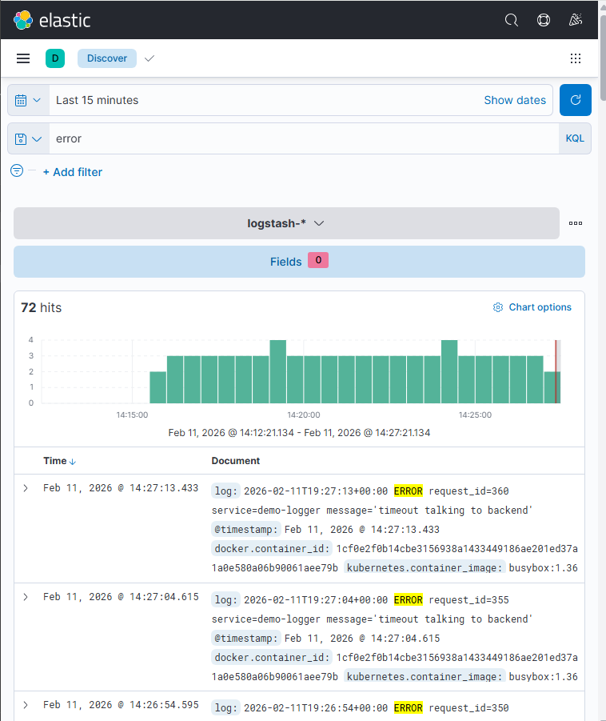
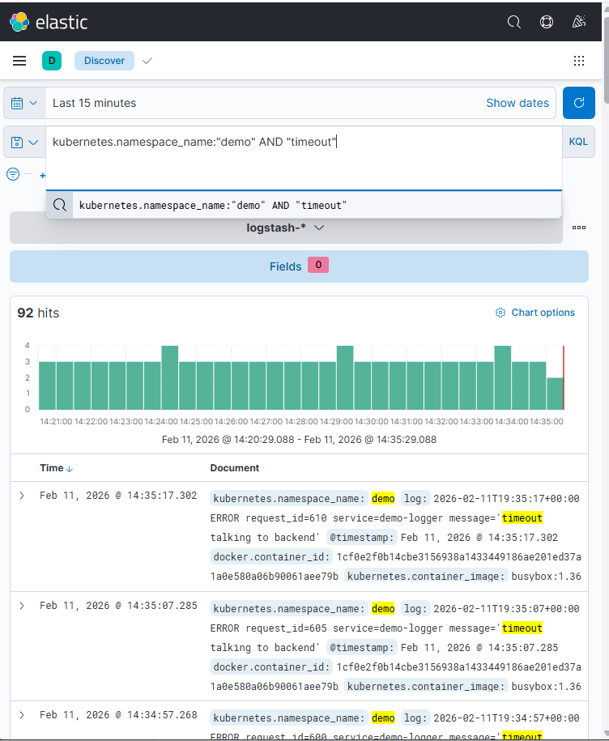

# Centralized Logging on Minikube (EFK) — Incident Log Search

I built a **centralized logging stack (EFK = Elasticsearch + Fluentd + Kibana)** on **Minikube** so I can collect logs from all pods/namespaces in one place, then **search + filter** logs fast during incidents (instead of SSH-ing into nodes or tailing logs one by one).

---

## Problem

When an incident happens, logs are usually **scattered**:
- App logs are inside pods (and pods restart)
- Multiple namespaces/services make it hard to know where to look
- `kubectl logs` works, but during a real incident you need:
  - **search**
  - **time-based filtering**
  - **correlation across services**
  - **error pattern detection**

So the problem is: **I need one place to store and search logs across the cluster.**

---

## Solution

I deployed an **EFK logging pipeline** in Minikube:

- **Fluentd** runs as a **DaemonSet** and collects logs from every node
- Fluentd forwards logs to **Elasticsearch**
- **Kibana** connects to Elasticsearch so I can:
  - search logs (`error`, `timeout`, `500`)
  - filter by namespace, pod, container
  - zoom in by time range during the incident

This gives me a real incident workflow:
**Alert → open Kibana → search errors → find the failing service → confirm root cause → validate fix.**

---

## Architecture Diagram



This diagram shows Kubernetes pod logs flowing from all namespaces into Fluentd on each node, then being stored in Elasticsearch and visualized in Kibana for searching, filtering, and troubleshooting by time/namespace/pod.


---

## Step-by-step CLI (with screenshots)

> Create the screenshots folder (once):
```bash
mkdir -p screenshots
````

### 1) Start Minikube (enough resources for Elasticsearch)

```bash
minikube start --cpus=4 --memory=8192
kubectl get nodes
```

---

### 2) Create a namespace for logging

```bash
kubectl create namespace logging
kubectl get ns
```

---

### 3) Deploy Elasticsearch (single-node for Minikube demo)

```bash
kubectl apply -n logging -f elasticsearch.yaml
kubectl get pods -n logging -w
```
📸 `screenshots/01-efk-pods-running.png`


Validate Elasticsearch is up:

```bash
kubectl get svc -n logging
kubectl get endpoints -n logging
kubectl logs -n logging deploy/elasticsearch --tail=50

📸 `screenshots/02-elasticsearch-service.png`


---

### 4) Deploy Kibana

```bash
kubectl apply -n logging -f kibana.yaml
kubectl get pods -n logging -w
kubectl get svc -n logging

```
📸 `screenshots/05-kibana-running.png`


---

### 5) Deploy Fluentd (DaemonSet) to collect cluster logs

```bash
kubectl apply -n logging -f fluentd-configmap.yaml
kubectl apply -n logging -f fluentd-daemonset.yaml
kubectl get pods -n logging -o wide

kubectl get ds -n logging && kubectl get pods -n logging -l app=fluentd -o wide
```

📸 `screenshots/03-fluentd-daemonset.png`


Confirm Fluentd is running on nodes:

```bash
kubectl describe ds -n logging fluentd | sed -n '1,120p'
kubectl logs -n logging ds/fluentd --tail=50
```

---

### 6) Generate demo logs (simulate an incident)

Create a noisy app that outputs errors:

```bash
kubectl create ns demo
kubectl apply -n demo -f demo-app.yaml
kubectl get pods -n demo -w
```

Then confirm logs exist:

```bash
kubectl logs -n demo deploy/demo-logger --tail=50
```
📸 `screenshots/04-demo-logs.png`


---

### 7) Access Kibana UI (port-forward)

```bash
kubectl port-forward -n logging svc/kibana 5601:5601
```

Open browser:

* [http://localhost:5601](http://localhost:5601)

---

### 8) Create index pattern in Kibana (Data View)

In Kibana:

* Stack Management → Data Views (Index Patterns)
* Create data view: `logstash-*` (the index i configured)
* Time field: `@timestamp`

📸 `screenshots/06-index-pattern.png`


---

### 9) Search logs like an incident responder

Examples to run in Kibana search:

* `error`
* `kubernetes.namespace_name:"demo" AND "timeout"`
* `kubernetes.pod_name:*demo* AND "500"`

📸 `screenshots/07-kibana-error-search.png`


📸 `screenshots/08-filter-by-namespace.png`


---

## Outcome

After deploying EFK on Minikube, I can:

* collect logs from **every pod** centrally
* search logs fast by:

  * error keywords
  * time window
  * namespace/pod/container
* correlate failures across services during incidents
* reduce incident response time because log search is instant

---

## Troubleshooting

### Kibana loads but shows “no data”

**Fix checks:**

```bash
kubectl logs -n logging ds/fluentd --tail=80
kubectl logs -n logging deploy/elasticsearch --tail=80
```

Also confirm indices exist in Elasticsearch:

```bash
kubectl port-forward -n logging svc/elasticsearch 9200:9200
curl -s http://localhost:9200/_cat/indices?v
```

### Elasticsearch pod keeps restarting (OOM / resources)

Minikube needs more memory:

```bash
minikube stop
minikube start --cpus=4 --memory=8192
```

### Fluentd running but nothing appears in Elasticsearch

Check Fluentd configmap and output plugin:

```bash
kubectl get cm -n logging fluentd-config -o yaml | sed -n '1,200p'
kubectl logs -n logging ds/fluentd --tail=200
```

### Kibana can’t connect to Elasticsearch

Confirm environment variables and service DNS:

```bash
kubectl describe pod -n logging -l app=kibana | sed -n '1,200p'
kubectl get svc -n logging
```

### “Connection refused” when curling Elasticsearch

Make sure the port-forward is running:

```bash
kubectl port-forward -n logging svc/elasticsearch 9200:9200
curl -s http://localhost:9200
```

---

## Repo Structure (example)

```text
centralized-logging-efk/
├── README.md
├── elasticsearch.yaml
├── kibana.yaml
├── fluentd-configmap.yaml
├── fluentd-daemonset.yaml
├── demo-app.yaml
└── screenshots/
    ├── 01-efk-pods-running.png
    ├── 02-elasticsearch-service.png
    ├── 03-fluentd-daemonset.png
    ├── 04-demo-logs.png
    ├── 05-kibana-home.png
    ├── 06-index-pattern.png
    ├── 07-kibana-error-search.png
    └── 08-filter-by-namespace.png
```

```
```
